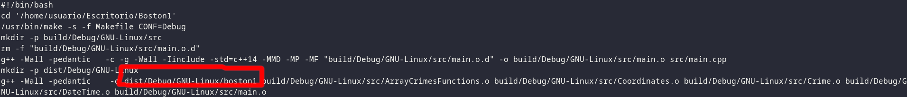

# Pasar_tests_MP
Script en Bash que pasa los tests proporcionados por el profesor Andrés Cano Utrera en la asignatura de MP de la UGR.
### Motivaciones
Comprobar los tests manualmente es un trabajo tedioso, cuando haciendo un script se tarda menos que pasando todos los tests en sucesivos proyectos.
### Características
- Muestra el código cuando algún test falla, facilitando así la depuración.
- Manipula correctamente los archivos para que los tests puedan pasarse seguidamente (pasar, corregir y volver a pasar).
- Tiene una opción para seleccionar un intervalo de tests a pasar. Útil cuando solo se quieren comprobar intervalos específicos de tests.
- Puede pasar los tests de integridad. La diferencia frente al script proporcionado por el profesor, es que este sí pasa el comprobador de fugas de memoria Valgrind (pues, en nuestro caso, nos salían los tests de integridad bien con su script y en la corrección se vio que no). Aunque seguramente sea fallo nuestro.
- La interfaz del script que pasa los tests de integridad cuando un test falla usa el comando differ, que puede ser muy difícil de interpretar para alguien novato en este comando.
- Puede ejecutar el script proporcionado por los profesores para crear el zip si todos los tests han salido correctos (o han necesitado comprobación manual).
- Modularizado en funciones y con un código fuente totalmente comentado para una legibilidad alta.
### Capturas


### Instrucciones para la configuración
##### Recomendaciones previas
Tener en la pantalla a la vez el archivo de configuración (config.sh) y esta página, para poder rellenar las variables mientras se lee la información.
##### Pasos a seguir
  
1. Tras haber terminado el proyecto completamente (asegúrese de que compila correctamente). Copiar el proyecto en una carpeta nueva (que va a manipular este script). Esto es necesario porque vamos a tener que modificar el main.cpp manteniendo el original. Y si renombras el main antiguo, no compilará para NetBeans, pues intentará compilar todos los archivos .cpp que haya en el proyecto y se encontrará con dos main.cpp.
  
2. Rellenar la variable PROYECTO con la ruta a la carpeta del nuevo proyecto creado. Sirvan de ejemplo, de aquí en adelante, las rutas que hay predefinidas.
  
	**Nota importante**: he observado que mi script no maneja bien las rutas en las que haya espacios, serán seguramente algunas comillas que haya omitido en alguna parte del script, pero **no** voy a arreglarlo (no me merece la pena).
  
2. Rellenar la variable ARCHIVO_MD, esta variable contiene la ruta al archivo con los tests a ejecutar, nos los pasan los profesores como «TestReport.md», aunque no funciona, pues los tests están mal (les falta un `cout` al final para que muestre el resultado, y, a veces un `boolalpha` o alguna cosa más). No obstante, [aquí](https://github.com/scasgar1312/Pasar_tests_MP#uso) se encuentra un enlace (cortesía de Manuel RA) con el TestReport.md corregido para que pueda omitir su corrección. Por tanto, simplemente especifique la ruta a ese archivo.
  
3. DIR_BASURA es una variable a una ruta que no exista, puede ser cualquiera (mientras no tenga espacios). Se trata de que no exista porque será usada por el script durante su ejecución y finalmente la **borrará completamente**. Supuestamente el script comprueba que no exista antes de ejecutarse para evitar que borre carpetas no vacías, pero es posible que esta característica no funcione.
  
4. MAIN: esta variable apunta al archivo main.cpp del proyecto que ha copiado en una nueva carpeta, para mayor comodidad, puede usarse la variable previamente declarada `$PROYECTO`. Si tiene el archivo main.cpp en la carpeta src de su proyecto, no hace falta que modifique esta variable.
  
5. MAIN_CORRECTO: archivo main.cpp del proyecto original (no de la copia del proyecto que ha creado). Generalmente se encuentra en la ruta de proyecto original dentro de la carpeta src.
6. COMPILAR: ruta a un script que compile el proyecto que ha copiado.
	1. Manera manual (recomendada):
		1. Abra en NetBeans la copia del proyecto que ha creado.
		2. Cierre todas las pestañas de la parte inferior de NetBeans.
		
		3. Pulse en el botón de la flecha verde, y en la parte inferior de NetBeans aparecerán dos pestañas: una que se llama «Nombre del proyecto (Run)», y otra «Nombre del proyecto (Build, Run)». Váyase a la pestaña de «Nombre del proyecto (Build, Run)».
		
		4. Copie los comandos de compilación de NetBeans. Estos son todos aquellos que no empiecen por comillas (si copia los que tienen comillas, aparentemente no pasa nada con respecto si no copia los que tienen comillas). Tampoco debe copiar los mensajes de «make», que aparecen como texto. En el siguiente ejemplo aparecen marcados con una línea en rojo al final las líneas que no deberían ser copiadas.
		
	**Nota importante**: si aparece un mensaje de «make[2]: 'dist/Debug/GNU-Linux/boston1' está actualizado.». Entonces, quiere decir que NetBeans ha detectado que no ha habido ningún cambio en el proyecto, así que no ha vuelto a compilarlo. Por tanto, deberá hacer un cambio cualquiera (añadir o quitar un comentario sin importancia) para obligar a que NetBeans detecte que el proyecto no es el mismo y lo compile.
		5. Guarde los comandos copiados en un nuevo archivo. **Recomendación**: encabece ese archivo como si fuera un script en Bash, es decir, añada en la primera línea: `#!/bin/bash`
	2. Usando el archivo de ejemplo. En la carpeta de ejemplo que se encuentra en este repositorio hay un archivo comandos_todo.sh de ejemplo. Debe cambiar la ruta que aparece en el primer comando (el comando cd) para que haga cd a la ruta de la copia del proyecto que ha creado.
  
3. COMPILAR_MAIN: esta es una variable que, para mayor comodidad (y mucha menor eficiencia en la ejecución del script), puede copiar el valor de la anterior (COMPILAR).
	1. Manera manual (recomendada):
		1. Abra en NetBeans la copia del proyecto que ha creado.
		2. Cierre todas las pestañas de la parte inferior de NetBeans.
		
		3. Haga click derecho en el archivo main.cpp en el árbol de directorios del proyecto (parte izquierda de NetBeans) y dele a la opción compilar archivo (o pulse F9 con el archivo main.cpp abierto).
		4. Copie los comandos de NetBeans que aparecen después de «CLEAN SUCCESSFUL». Tenga en cuenta las mismas consideraciones que para la variable COMPILAR.
		5. Cree un nuevo archivo (con la línea `!#/bin/bash` de cabecera) con esos comandos. Y muy **importante** copie el último comando de su archivo `$COMPILAR` y añádalo a este. Pues si no, este script no creará el ejecutable y el script no funcionará.
	2. Con el ejemplo: hay un archivo en la carpeta ejemplos de este repositorio que se llama compilar.sh. Cambie la ruta del comando cd y ya debería funcionar. Si, en algún caso, no funcionara, hágalo manualmente.
4. DECLARACION_MAIN: Escribir en un archivo cómo debe iniciar el programa la función main() (esto previene por si, en un futuro, tuviéramos que cambiar la declaración del main()). Ejemplo:
  
```
int main () {
```
Nótese que en la carpeta ejemplo se encuentran ya unos archivos main_inicio.txt y main_cierre.txt que se pueden usar.
  
6. Escribir en un archivo cómo debe cerrar el programa la función main() (esto previene al programa por si, en un futuro, tuviéramos que cambiar el cierre del main()). Ejemplo:
  
```
return 0;
}
```
  
7. Apuntar la ruta absoluta al archivo resultante de la compilación (el ejecutable). Ejemplo:
  
$PROYECTO/dist/Debug/GNU-Linux/boston-0
  
¿Dónde encontrarlo? Suele encontrarse en el último comando de compilación de NetBeans. Exactamente el primer archivo que aparece (no aparece con la ruta absoluta, sino relativa a la raíz del proyecto). Truco: puede usar la variable $PROYECTO previamente creada para evitar copiar la ruta a la copia del proyecto que ha creado.

8. Modificar el archivo main.cpp de la copia del proyecto, vacíelo menos los `include` y el `using namespace std;`, es decir, borre la función `main` completamente.
9. Copie el código que debemos poner en el main.cpp para pasar los tests de integridad. Recomendación: ejecute
```
cat /ruta/a/TestReport.HowToTestUnitTests
```
Y copie el código que digan los profesores que tenemos que poner en el main.cpp para pasar los tests de unidad. Ejemplo:

8. Modificar las últimas variables de configuración, cuyo comentario me parece lo suficientemente explicativo para que entienda lo que hacen.

9. Ha habido un cambio en la variable ENTRADAS_Y_SALIDAS_INTEGRIDAD. Ahora debe contener la ruta a la carpeta (sin la barra "/") en la que se encuentran los archivos .test. Generalmente es "$PROYECTO/tests".

### Uso
Para comenzar a usar el script necesita tener configurados todos las variables en el archivo config.sh. Esto lo tendrá hecho si ha seguido los pasos anteriores.

Una vez configurado siguiendo las instrucciones de fichero de configuración, puede usarse indefinidamente. Es decir, puede pasar los tests, ver en los que ha fallado, corregir los fallos (**importante** los debe corregir tanto en el proyecto que ha copiado como en el original, pues si solo los modifica en el original los cambios no llegan a la copia, y si solo los modifica en la copia, no se queda con los cambios en el original).

Nota: Muchas veces me ha pasado que he creído un fallo en el script pero estaba en la configuración. Por tanto, revise la configuración dos veces. Tampoco interrumpa la ejecución del script, pues entonces el programa no restaurará el main.cpp para que se puedan volver a pasar y tendrá que volverlo a hacer manualmente antes de poder volverlo a ejecutar.

Por cortesía de Manuel RA, el TestReport.md ya corregido está en el siguiente enlace: [https://0.jaegers.net/?bbbfc31bfe4e268b#EZirLXXSwiUhsKSMyY9Tc9fn3ygj5vNf3E5cJocvHthn](https://0.jaegers.net/?bbbfc31bfe4e268b#EZirLXXSwiUhsKSMyY9Tc9fn3ygj5vNf3E5cJocvHthn)

Una vez configurado y preparado, ejecute: `bash Pasar\ tests.sh`
